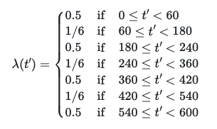
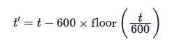

# Changing the arrival process I

Lets now turn to yet another part of the problem statement that you are given in the assignment.  You are told:

> Customers do not arrive at a uniform rate during the day. There is usually a rush from 9:00-10:00, at lunch from 12:00-13:00, at around 15:00-16:00 and from 18:00-19:00 when folks leave work and head home. During these busy periods, the average rate of arrivals is approximately 30 customers per hour. In less busy times, the rate of arrivals is ten customers per hour.

In my simulations, however, I have assumed that customers arrive at a uniform rate throughout the day.  Your task in this exercise is thus to modify the code on the left that simulates the queue for a cup of tea (neglecting the variance from the problem statement).  I want your revised simulator to take into account the fact that the number of arrivals depends on the time of day as discussed in the question.

Notice that you can use something like the following function to describe how the rate changes during a single day:

To ensure that t' is between 0 and 600 (and thus telling you the time of day) you can do the following

This ensures that you subtract 600 minutes from the time if the time you are given is at some point on day 2.  __Please do not change the name of the function called `rate` when you tackle this exercise as this is the function that is being tested.__ 
